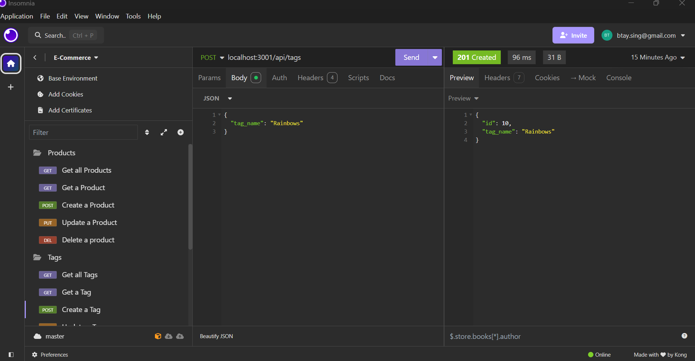

# E-Commerce

## Description
Welcome to the E-Commerce shop. View all of our products, categories, and tags. This application lets you test adding, deleting, and updating any product, category, or tag. Test it out in Insomnia!

## Technologies Used
Javascript, Express, pg,, Sequelize, dotenv, PostgreSQL, Node modules.

## Installation
1. Clone the repository: git clone https://github.com/yourusername/E-Commerce.git
2. cd into the project
3. run npm run seed
4. run npm run start
5. Make sure you have Insomnia downloaded

## Usage
1. Open your terminal
2. Type npm run seed
3. Type npm run start
4. Follow along in the video provided in the link below!

## Contributing
If you would like to contribute to this project, please fork the repository and submit a pull request with any changes.

## License
This project is not licensed.

## Links
Github: https://github.com/Betzaida96/E-Commerce

Demo Video: https://drive.google.com/file/d/1NVcANNi2Ahgfpy727rQVJIeewzFnYXA0/view

## Photos
